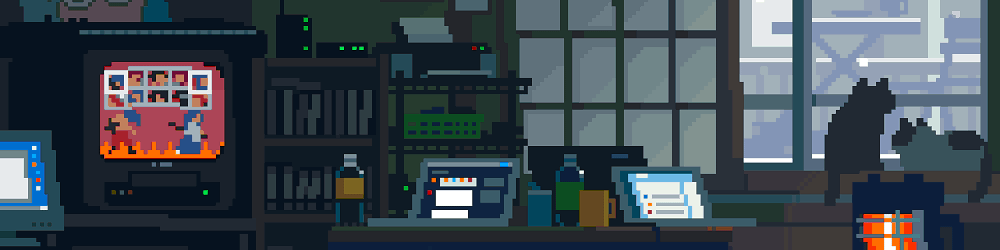

<!-- ─────────────  banner  ───────────── -->

<div align="center">



<br><br>


</div>

---

### ✦ about me

```yaml
name:        dumiflex
location:    bucharest, romania 🇷🇴
studying:    economic informatics @ ase (CSIE)
focused on:  TypeScript · Vue · Node · Python
side quest:  shipping ComfyUI Wildcard Pipeline
status:      🟢 open to junior dev roles
loves:       cats · anime · lo-fi nights · drawing
fun fact:    learned to code from docs before AI was a thing
```

<div align="center">


<br>

[](https://www.linkedin.com/in/dumiflex)
[](https://discord.com/users/425823717436948493)
[](mailto:p.dumiflex@gmail.com)

</div>

---

### 💻 tech stack

🪴 **comfortable**


🌿 **familiar with**


🛠 **daily tools**


🤖 **AI co-pilots**


---

### 🚀 projects

| project | what |
|---|---|
| **[ComfyUI Wildcard Pipeline](https://github.com/DumiFlex/ComfyUI-Wildcard-Pipeline)** | open-source ComfyUI plugin · weighted wildcards + chained modules · published on the official registry 🌸 |
| **wildcard pipeline v2** | full rewrite — bundle system, drift detection, SQLite library 🛠️ *(in progress)* |
| **discord bots** | custom bots in Node.js · learned from docs before AI tools existed 🤖 |
